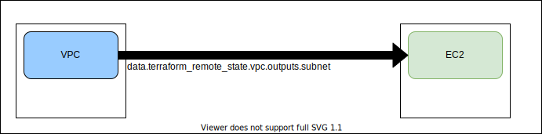

# Terraform remote state changes
Terraform is a tool that contributed a lot to the revolution of the Infrastructure as a Code paradigm. Hashicorp now is putting huge effort into supporting and improving day to day case scenarios that are painful in complex environments managed by Terraform. Last year they published a great blog article about the future and their vision of Terraform:

https://www.hashicorp.com/resources/the-path-to-terraform-1-0

and it looks they stick to this plan.

The newest update of Terraform versions **v0.12.30**, **v0.13.6** and **v0.14.4** remove one of the most annoying limitations related to data source **terraform_remote_state**. This limitation required same or newer version of terraform to fetch value via data source terraform_remote_state (even for minor versions like 0.13.1 vs 0.13.2). So when the dependent repository had state file in a higher version such try finished with error

```
Error: state snapshot was created by Terraform v0.13.5, which is newer than current v0.13.1; upgrade to Terraform v0.13.5 or greater to work with this state
```

This has changes and the following release notes:

v0.12.30
>The builtin provider's terraform_remote_state data source no longer enforces Terraform version checks on the remote state file. This allows Terraform 0.12.30 to access remote state from future Terraform versions, up until a future incompatible state file version upgrade is required. (#26692)

v0.13.6
>The builtin provider's terraform_remote_state data source no longer enforces Terraform version checks on the remote state file. This allows Terraform 0.13.6 to access remote state from future Terraform versions, up until a future incompatible state file version upgrade is required. (#26692)

v0.14.4
>This release disables the remote Terraform version check feature for plan and apply operations. This fixes an issue with using custom Terraform version bundles in Terraform Enterprise. (#27319)

The difference between those release notes for 0.12/0.13 vs 0.14 is because starting 0.14 data source terraform_remote_state is as below:

>Note: This data source is implemented by a built-in provider, whose source address is terraform.io/builtin/terraform. That provider does not include any other resources or data sources.


Starting with those releases in scenarios when you use multiple dependent code repositories and multiple Terraform state files, you don't need to worry about planning very ordered updates of Terraform version across all source code repositories.

## Live demo

Let's take a look at an example of how it was earlier and how it is now.
I created very simple demo repository with 2 modules:
- vpc
- ec2

which probably reflect the most common use case for this feature. We create a network using one module and instances are created in another module, but some data (in this case subnet) is fetched from vpc module. This is visible on diagram:



So let's check this and pull demo code repository:
```
$ git clone https://github.com/ccnative/terraform_remote_state-demo.git
```

and go to module vpc:
```
$ cd terraform_remote_state-demo/vpc
```

Current Terraform version is:
```
$ terraform version
Terraform v0.14.4
+ provider registry.terraform.io/hashicorp/aws v2.70.0
```

Initializing terraform workspace:
```
$ terraform init

Initializing the backend...

Successfully configured the backend "local"! Terraform will automatically
use this backend unless the backend configuration changes.

Initializing provider plugins...
- Finding hashicorp/aws versions matching "~> 2.70"...
- Installing hashicorp/aws v2.70.0...
- Installed hashicorp/aws v2.70.0 (signed by HashiCorp)

Terraform has been successfully initialized!

You may now begin working with Terraform. Try running "terraform plan" to see
any changes that are required for your infrastructure. All Terraform commands
should now work.

If you ever set or change modules or backend configuration for Terraform,
rerun this command to reinitialize your working directory. If you forget, other
commands will detect it and remind you to do so if necessary.
```

and apply code to AWS:
```
$ terraform apply 

An execution plan has been generated and is shown below.
Resource actions are indicated with the following symbols:
  + create

Terraform will perform the following actions:

  # aws_subnet.test-subnet will be created
  + resource "aws_subnet" "test-subnet" {
      + arn                             = (known after apply)
      + assign_ipv6_address_on_creation = false
      + availability_zone               = (known after apply)
      + availability_zone_id            = (known after apply)
      + cidr_block                      = "10.100.0.0/24"
      + id                              = (known after apply)
      + ipv6_cidr_block                 = (known after apply)
      + ipv6_cidr_block_association_id  = (known after apply)
      + map_public_ip_on_launch         = false
      + owner_id                        = (known after apply)
      + tags                            = {
          + "Environment" = "demo"
          + "Name"        = "test-subnet"
        }
      + vpc_id                          = (known after apply)
    }

  # aws_vpc.test-vpc will be created
  + resource "aws_vpc" "test-vpc" {
      + arn                              = (known after apply)
      + assign_generated_ipv6_cidr_block = false
      + cidr_block                       = "10.100.0.0/16"
      + default_network_acl_id           = (known after apply)
      + default_route_table_id           = (known after apply)
      + default_security_group_id        = (known after apply)
      + dhcp_options_id                  = (known after apply)
      + enable_classiclink               = (known after apply)
      + enable_classiclink_dns_support   = (known after apply)
      + enable_dns_hostnames             = (known after apply)
      + enable_dns_support               = true
      + id                               = (known after apply)
      + instance_tenancy                 = "default"
      + ipv6_association_id              = (known after apply)
      + ipv6_cidr_block                  = (known after apply)
      + main_route_table_id              = (known after apply)
      + owner_id                         = (known after apply)
      + tags                             = {
          + "Environment" = "demo"
          + "Name"        = "test-vpc"
        }
    }

Plan: 2 to add, 0 to change, 0 to destroy.

Do you want to perform these actions?
  Terraform will perform the actions described above.
  Only 'yes' will be accepted to approve.

  Enter a value: yes

aws_vpc.test-vpc: Creating...
aws_vpc.test-vpc: Still creating... [10s elapsed]
aws_vpc.test-vpc: Creation complete after 12s [id=vpc-0deca3eed58b5a90a]
aws_subnet.test-subnet: Creating...
aws_subnet.test-subnet: Creation complete after 5s [id=subnet-0e874d859d9ca5543]

Apply complete! Resources: 2 added, 0 changed, 0 destroyed.

The state of your infrastructure has been saved to the path
below. This state is required to modify and destroy your
infrastructure, so keep it safe. To inspect the complete state
use the `terraform show` command.

State path: terraform.tfstate

Outputs:

subnet = subnet-0e874d859d9ca5543
```

So this created VPC and subnet, **subnet_id** was passed to outputs as ***subnet**. Lets move to second module ec2:
```
$ cd ../ec2/
```

I am using [tfenv](https://github.com/tfutils/tfenv) tool which is very handfull in case of multiple Terraform repositories with different versions as allowing fast switch between them:
```
$ tfenv list
* 0.14.4 (set by /usr/local/Cellar/tfenv/2.0.0/version)
  0.13.6
  0.13.5
  0.13.1
  0.12.29
$ tfenv use 0.13.5
Switching default version to v0.13.5
Switching completed
```

Lets initialize workspace:
```
$ terraform init

Initializing the backend...

Successfully configured the backend "local"! Terraform will automatically
use this backend unless the backend configuration changes.

Initializing provider plugins...
- terraform.io/builtin/terraform is built in to Terraform
- Finding hashicorp/aws versions matching "~> 2.70"...
- Installing hashicorp/aws v2.70.0...
- Installed hashicorp/aws v2.70.0 (signed by HashiCorp)

Terraform has been successfully initialized!

You may now begin working with Terraform. Try running "terraform plan" to see
any changes that are required for your infrastructure. All Terraform commands
should now work.

If you ever set or change modules or backend configuration for Terraform,
rerun this command to reinitialize your working directory. If you forget, other
commands will detect it and remind you to do so if necessary.
```

and try apply code:
```
$ terraform apply
data.terraform_remote_state.vpc: Refreshing state...
data.aws_ami.ubuntu: Refreshing state...

Error: state snapshot was created by Terraform v0.14.4, which is newer than current v0.13.5; upgrade to Terraform v0.14.4 or greater to work with this state
```

So it failed because we are trying fetch data source terraform_remote_state value from Terraform state which was written in higher version of Terraform.

Lets check newest 0.13 version:
```
$ tfenv use 0.13.6
Switching default version to v0.13.6
Switching completed
```

and reapply:
```
$ terraform apply
data.terraform_remote_state.vpc: Refreshing state...
data.aws_ami.ubuntu: Refreshing state...

An execution plan has been generated and is shown below.
Resource actions are indicated with the following symbols:
  + create

Terraform will perform the following actions:

  # aws_instance.test-instance will be created
  + resource "aws_instance" "test-instance" {
      + ami                          = "ami-0745d55d209ff6afd"
      + arn                          = (known after apply)
      + associate_public_ip_address  = (known after apply)
      + availability_zone            = (known after apply)
      + cpu_core_count               = (known after apply)
      + cpu_threads_per_core         = (known after apply)
      + get_password_data            = false
      + host_id                      = (known after apply)
      + id                           = (known after apply)
      + instance_state               = (known after apply)
      + instance_type                = "t3.micro"
      + ipv6_address_count           = (known after apply)
      + ipv6_addresses               = (known after apply)
      + key_name                     = (known after apply)
      + network_interface_id         = (known after apply)
      + outpost_arn                  = (known after apply)
      + password_data                = (known after apply)
      + placement_group              = (known after apply)
      + primary_network_interface_id = (known after apply)
      + private_dns                  = (known after apply)
      + private_ip                   = (known after apply)
      + public_dns                   = (known after apply)
      + public_ip                    = (known after apply)
      + security_groups              = (known after apply)
      + source_dest_check            = true
      + subnet_id                    = "subnet-0ed5372d6d31a374c"
      + tags                         = {
          + "Name" = "test-instance"
        }
      + tenancy                      = (known after apply)
      + volume_tags                  = (known after apply)
      + vpc_security_group_ids       = (known after apply)

      + ebs_block_device {
          + delete_on_termination = (known after apply)
          + device_name           = (known after apply)
          + encrypted             = (known after apply)
          + iops                  = (known after apply)
          + kms_key_id            = (known after apply)
          + snapshot_id           = (known after apply)
          + volume_id             = (known after apply)
          + volume_size           = (known after apply)
          + volume_type           = (known after apply)
        }

      + ephemeral_block_device {
          + device_name  = (known after apply)
          + no_device    = (known after apply)
          + virtual_name = (known after apply)
        }

      + metadata_options {
          + http_endpoint               = (known after apply)
          + http_put_response_hop_limit = (known after apply)
          + http_tokens                 = (known after apply)
        }

      + network_interface {
          + delete_on_termination = (known after apply)
          + device_index          = (known after apply)
          + network_interface_id  = (known after apply)
        }

      + root_block_device {
          + delete_on_termination = (known after apply)
          + device_name           = (known after apply)
          + encrypted             = (known after apply)
          + iops                  = (known after apply)
          + kms_key_id            = (known after apply)
          + volume_id             = (known after apply)
          + volume_size           = (known after apply)
          + volume_type           = (known after apply)
        }
    }

Plan: 1 to add, 0 to change, 0 to destroy.

Do you want to perform these actions?
  Terraform will perform the actions described above.
  Only 'yes' will be accepted to approve.

  Enter a value: yes

aws_instance.test-instance: Creating...
aws_instance.test-instance: Still creating... [10s elapsed]
aws_instance.test-instance: Creation complete after 18s [id=i-0843624d178e3b85c]

Apply complete! Resources: 1 added, 0 changed, 0 destroyed.

The state of your infrastructure has been saved to the path
below. This state is required to modify and destroy your
infrastructure, so keep it safe. To inspect the complete state
use the `terraform show` command.

State path: terraform.tfstate

Outputs:

ec2 = i-0843624d178e3b85c
```

Lets check `terraform_version` in state files:
```
$ cd ../
$ cat vpc/terraform.tfstate|jq -r ".terraform_version"
0.14.4
$ cat ec2/terraform.tfstate|jq -r ".terraform_version"
0.13.6
```

**So at this point we confirmed new releases of Terraform are working as expected.**


Destroy demo resources:
```
$ terraform destroy -auto-approve
data.terraform_remote_state.vpc: Refreshing state...
data.aws_ami.ubuntu: Refreshing state... [id=ami-0745d55d209ff6afd]
aws_instance.test-instance: Refreshing state... [id=i-0843624d178e3b85c]
aws_instance.test-instance: Destroying... [id=i-0843624d178e3b85c]
aws_instance.test-instance: Still destroying... [id=i-0843624d178e3b85c, 10s elapsed]
aws_instance.test-instance: Still destroying... [id=i-0843624d178e3b85c, 20s elapsed]
aws_instance.test-instance: Still destroying... [id=i-0843624d178e3b85c, 30s elapsed]
aws_instance.test-instance: Destruction complete after 33s

Destroy complete! Resources: 1 destroyed.

$ cd ../vpc

$ tfenv use 0.14.4
Switching default version to v0.14.4
Switching completed

$ terraform destroy -auto-approve
aws_subnet.test-subnet: Destroying... [id=subnet-0ed5372d6d31a374c]
aws_subnet.test-subnet: Destruction complete after 2s
aws_vpc.test-vpc: Destroying... [id=vpc-0583d177db5ffb36d]
aws_vpc.test-vpc: Destruction complete after 1s

Destroy complete! Resources: 2 destroyed.
```

## Summary

This Terraform change is a very desired and expected change, beneficial mostly to organizations with complex Terraform repositories dependent on others. It will break dependencies in Terraform version updates and speed up them in many organizations.


## Links:

* https://www.hashicorp.com/resources/the-path-to-terraform-1-0
* https://github.com/ccnative/terraform_remote_state-demo
* https://github.com/hashicorp/terraform/releases/tag/v0.12.30
* https://github.com/hashicorp/terraform/releases/tag/v0.13.6
* https://github.com/hashicorp/terraform/releases/tag/v0.14.4
